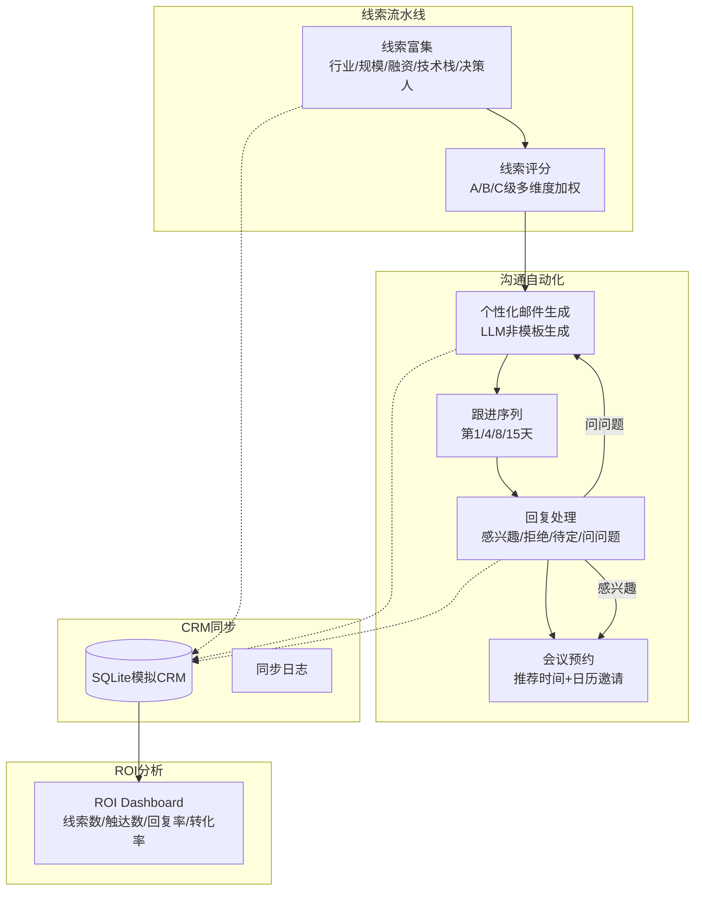

# 智能销售 Agent — 架构设计

## 系统架构图

## 核心模块
1. 线索富集：模拟收集公司信息（标注模拟数据）
2. 线索评分：多维度加权A/B/C级评分
3. 个性化邮件生成：基于客户具体情况生成
4. 多轮跟进序列：3-5封邮件，不同角度
5. 邮件回复处理：自动分类+自动响应
6. 会议预约：推荐时间+模拟日历
7. CRM同步：SQLite存储+同步日志
8. ROI Dashboard：实时统计
